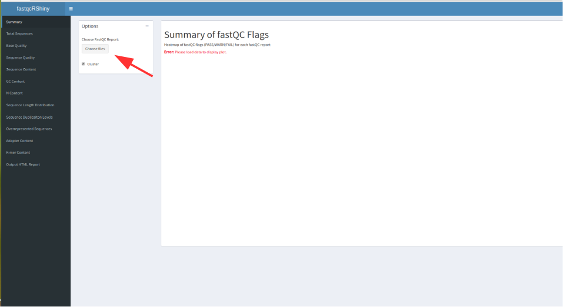
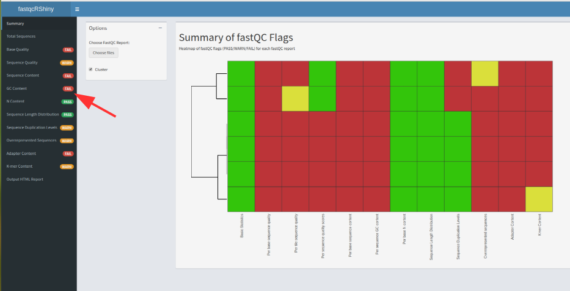
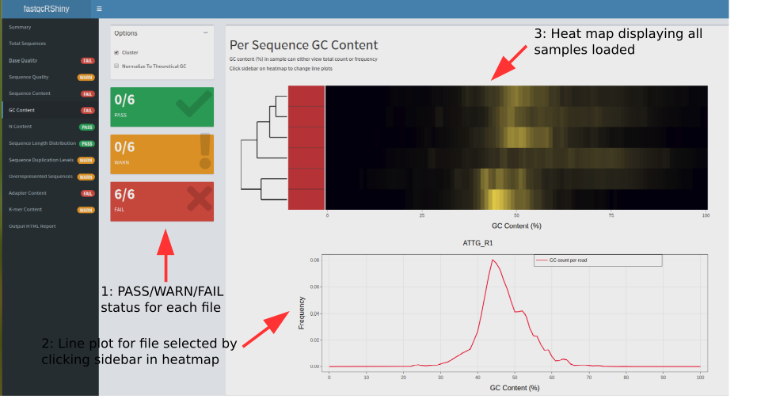
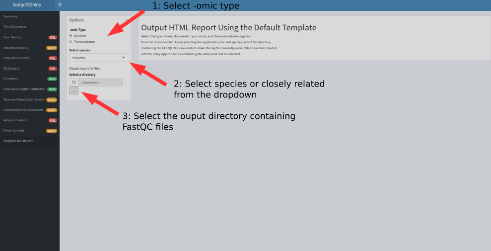

```{r, echo=FALSE}
knitr::opts_chunk$set(message = FALSE, warning = FALSE, eval=FALSE)
```


# Fast usage


The shiny app can be run after loading the base package `ngsReports` and the 
shiny app `ngsReportsShinyApp`. 

```{r, eval=FALSE, include=FALSE}
library(ngsReports)
library(ngsReportsShinyApp)

fastqcShiny()
```

This will open the shiny app. Files can then be imported by clicking the 
`Choose Files` button.



FastQC modules can then be selected using the sidebar. Each module has a 
summary of PASS/WARN/FAIL status across all FastQC files loaded.




After selecting a module, in this case the `GC Content` module, plots are
rendered and shown for all samples in heatmap format. 
A single sample can then be selected by clicking the sidebar on the heatmap.



Data in both the heatmap and line plot can be hovered over to display a tooltip
containing x and y axis information and module value. 


# Outputting the default HTML report from the shiny app

The default HTML report can also be run from the shiny app by selecting the
last tab from the sidebar. -Omic type (i.e. Genomic or Transciptomic) can
then be selected along with the species of interest. The directory containing 
fasqc files to construct a report for can then be selected using the elipsis on 
the choose files button.


